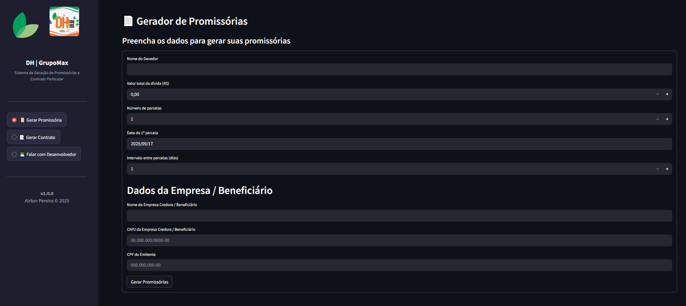
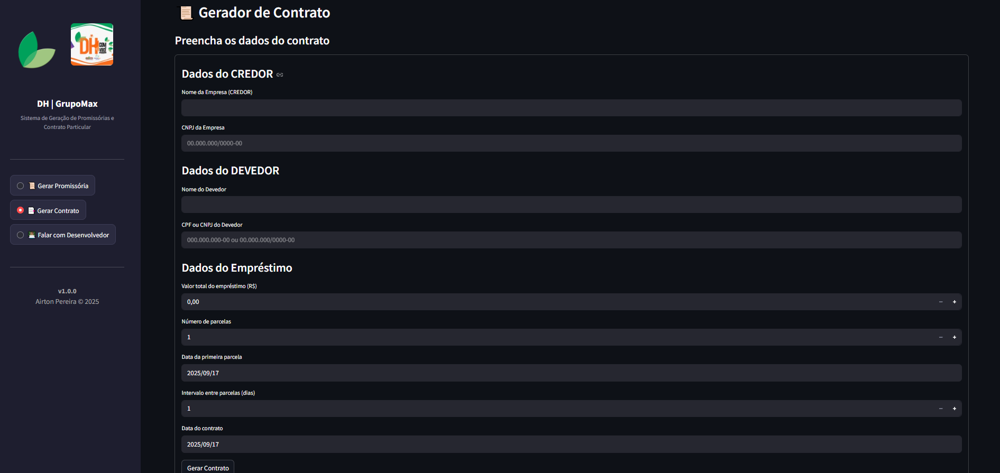
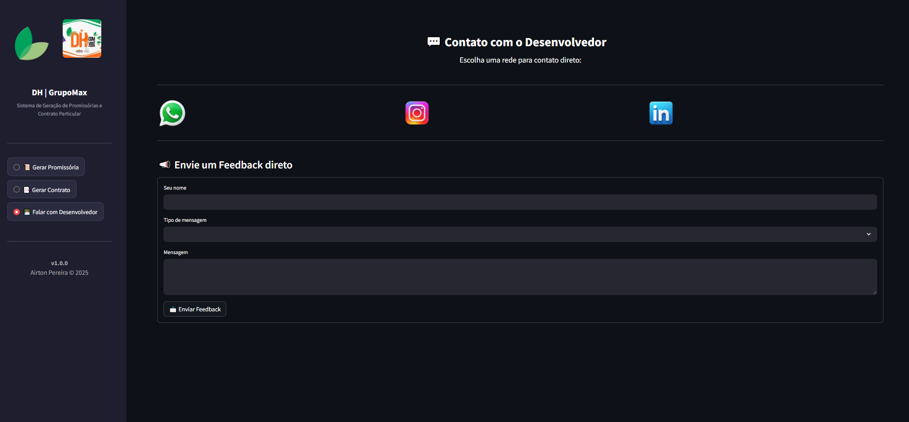
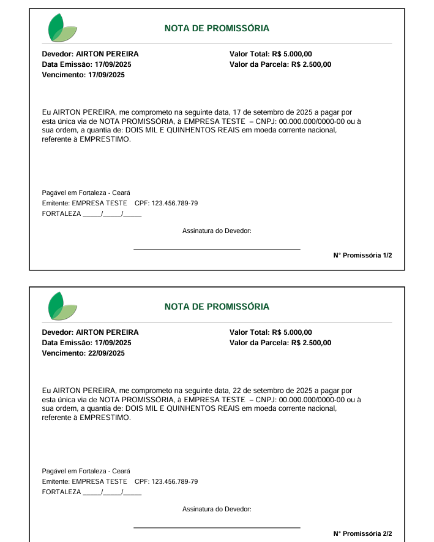
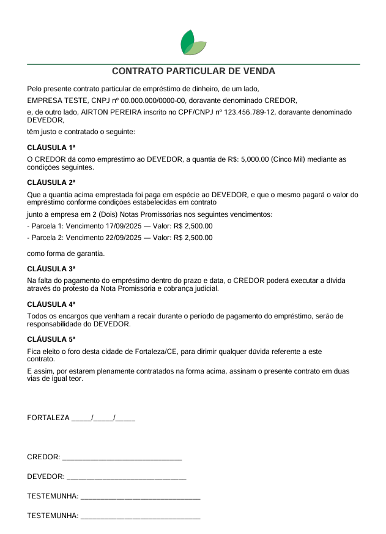

# 📄💰 Gerador de Promissórias & Contratos


---

## ✨ Visão Geral

O **Gerador de Promissórias & Contratos** é uma aplicação **profissional** desenvolvida em **Python + Streamlit** que automatiza a criação de promissórias parceladas e contratos personalizados em PDF.

💎 **Benefícios:**  
- Economia de tempo  
- Documentos confiáveis e estilizados  
- Apresentação **premium** para clientes  
</div>

---

## 🎯 Recursos Premium

<div style="display: flex; flex-direction: column; gap: 10px;">

- 📝 **Formulário interativo** com validação automática  
- 📄 **Geração de promissórias em PDF** com design profissional  
- 🔑 **CNPJ (corpo)** e **CPF (rodapé)** tratados de forma independente  
- 💰 **Valores por extenso** em português  
- 🛡️ **Máscaras de CPF e CNPJ**  
- ⏱️ **Limites de caracteres**  
- 🔢 **Numeração automática** das parcelas  
- 🖼️ **Inserção de logos personalizadas** no documento  
- 🗂️ **Nome de arquivo dinâmico**  
- ⏳ **Overlay animado de carregamento** ao gerar PDFs  
- 📊 **Exportação de contrato** com tabela de vencimentos  
- ☁️ **Compatível com Streamlit Cloud, Render, Heroku, Docker ou execução local**  
- 📥 **Download imediato do arquivo PDF**  
- 👀 **Pré-visualização interativa** antes da exportação  

</div>

---

## 🖼️ Interface do Sistema

<div style="display: flex; flex-wrap: wrap; gap: 15px; justify-content: space-between;">

### 💰 Gerar Promissórias


### 📜 Gerar Contrato


### 👨🏾‍💻 Contato com o Desenvolvedor


### ✉ Promissória Gerada


### 📑 Contrato Gerado


</div>

---

## 🏗️ Estrutura do Projeto

```text
promissorias_app/
├── .streamlit/
│   └── config.toml
├── main.py
├── estrutura.txt
├── README.md
├── requirements.txt
└── app/
    ├── assets/
    │   ├── images/
    │   │   ├── CONTRATO_GERADO.png
    │   │   ├── dh.png
    │   │   ├── logo.png
    │   │   ├── PAINEL_FALAR_COM_DESENVOLVEDOR.png
    │   │   ├── PAINEL_GERAR_CONTRATO.png
    │   │   ├── PAINEL_GERAR_PROMISSORIA.png
    │   │   └── PROMISSORIA_GERADA.png
    │   └── templates/
    │       ├── contrato.txt
    │       └── promissoria.txt
    ├── core/
    │   ├── generator.py
    │   ├── number_to_words.py
    │   ├── parser.py
    │   └── utils.py
    ├── export/
    │   ├── contrato_exporter.py
    │   └── pdf_exporter.py
    ├── falar_desenvolvedor/
    │   └── contato_dev.py
    ├── generator/
    │   ├── contrato_app.py
    │   └── promissorias_app.py
    └── utils/
        └── email_utils.py


| Tecnologias      | Descrição                                                         | Link                                                              |
| ---------------- | ----------------------------------------------------------------- | ----------------------------------------------------------------- |
| 🐍 Python 3.11+  | Linguagem principal do projeto                                    | [python.org](https://www.python.org/)                             |
| 🎨 Streamlit     | Criação da interface web interativa                               | [streamlit.io](https://streamlit.io/)                             |
| 📑 ReportLab     | Geração e estilização dos PDFs                                    | [reportlab.com](https://www.reportlab.com/dev/)                   |
| 🔢 Num2Words     | Conversão de números para texto por extenso                       | [pypi.org/project/num2words](https://pypi.org/project/num2words/) |
| 🛠️ Custom Utils  | Funções auxiliares (formatação de CPF, CNPJ e valores monetários) | `app/core/utils.py`                                               |


---

📦 Instalação Local

1️⃣ Clonar o repositório
git clone https://github.com/AirtonP7/promissorias_app.git
cd promissorias_app

2️⃣ Criar ambiente virtual
python -m venv venv
# Linux/Mac
source venv/bin/activate
# Windows
venv\Scripts\activate

3️⃣ Instalar dependências
pip install -r requirements.txt

4️⃣ Rodar aplicação localmente
streamlit run main.py


💻 O sistema abrirá em http://localhost:8501
.

### ☁️ Deploy no Streamlit Cloud

1. Faça push do projeto para o **GitHub**.
2. Acesse [Streamlit Cloud](https://streamlit.io/cloud) e faça login.
3. Clique em **New app**.
4. Conecte o repositório do GitHub onde está o projeto.
5. Configure:
   - **Main file path**: `main.py` (ou o nome do seu arquivo principal)
   - **Python version**: 3.11
   - **Requirements file**: `requirements.txt`
6. Clique em **Deploy** 🎉
7. Após alguns minutos, seu app estará disponível em uma URL no formato: 
    https://<seu-usuario>-<nome-do-projeto>.streamlit.app


🧑🏽‍💻 Desenvolvedor
Airton Pereira
📩 airtonpereiradev@gmail.com
💼 GitHub: AirtonP7

📌 Licença
Este projeto tem todos os direitos reservados ao desenvolvedor Airton Pereira.
Não é permitido uso ou redistribuição sem autorização prévia.
